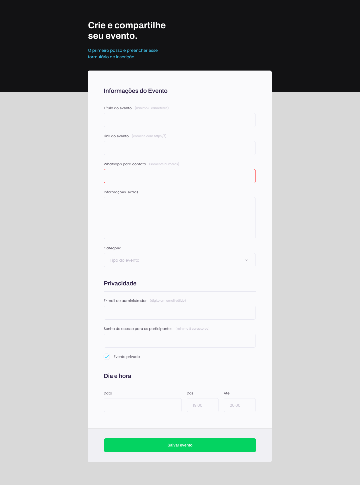
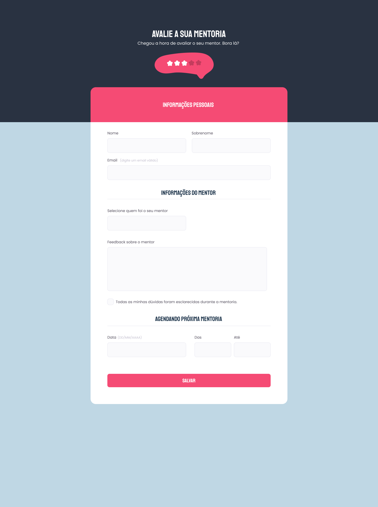

# Forms 📄⭐
  

 These were some projects proposed by Rocketseat, with the goal of creating three forms using HTML and CSS. 

#

#### <h3 align="center">**This project was developed with** </h3>

#### <h3 align="center">HTML | CSS | Figma | Git | GitHub </h3>

#

- [Event Creation Form](https://github.com/anaaaab/forms/tree/main/event-form)
- [Mentoring Scheduling Form](https://github.com/anaaaab/forms/tree/main/scheduling-form)
- [Mentoring Assessment Form](https://github.com/anaaaab/forms/tree/main/assessment-form)

    
    
    

#
  

<strong>Made with 🤍 by Ana Paula Bertuol </strong>

  

#### 
[Access my profile on LinkedIn here](https://www.linkedin.com/in/ana-paula-bertuol/) 

